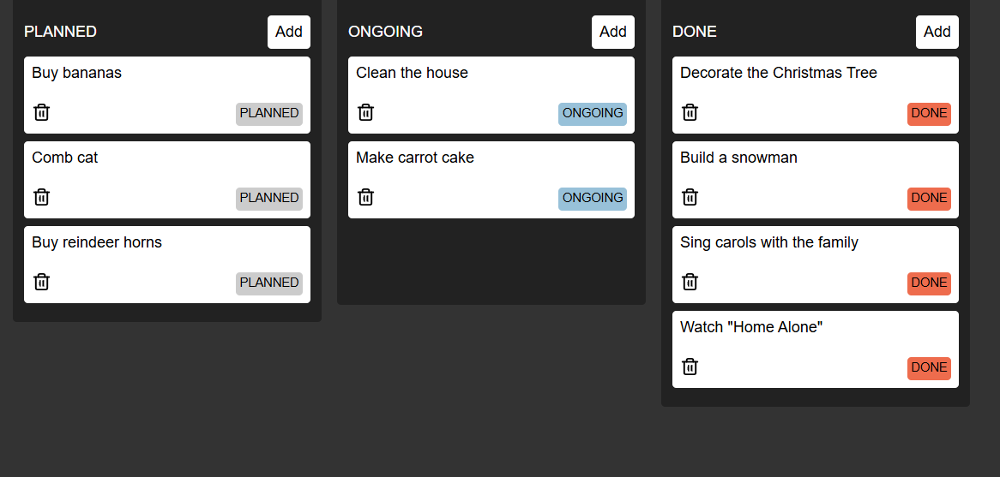
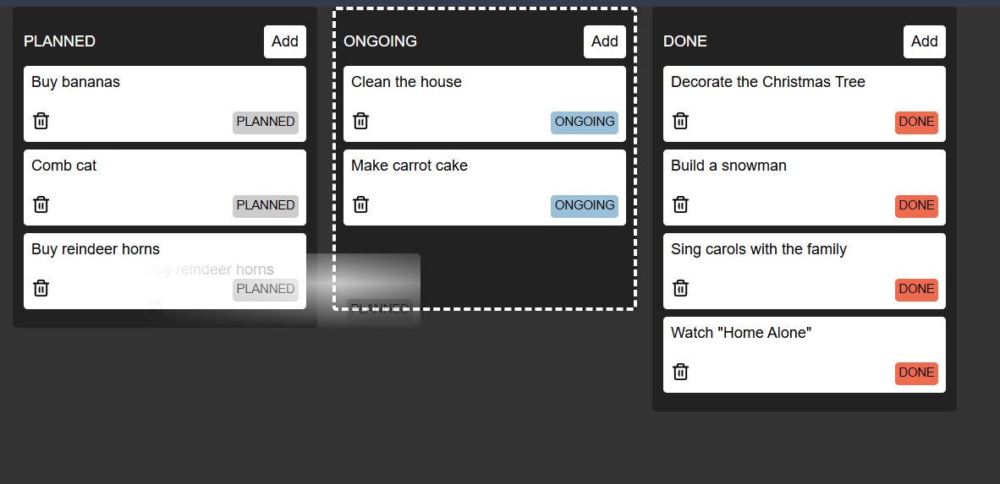
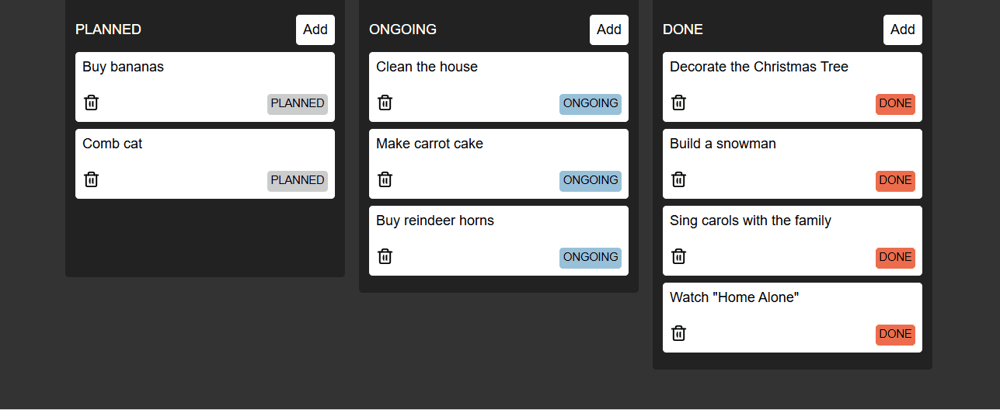

# Kanban board app built using Zustand

Zustand is a minimalistic state management library for React, offering a simpler API compared to Redux. It aims to provide ease-of-use without sacrificing flexibility and performance in modern web applications.  It provides a simple and intuitive API for managing and updating application state without the need for boilerplate code or complex patterns. 

This is the source code for the React-Zustand course I followed to build this Kanban board with tasks: https://www.youtube.com/watch?v=fZPgBnL2x-Q

The app looks like this:

It is possible to drag and drop tasks from one column to the other.

When dragging and dropping tasks, their status changes and the border of the columns turns into a dashed one .

# React + Vite

This template provides a minimal setup to get React working in Vite with HMR and some ESLint rules.

Currently, two official plugins are available:

- [@vitejs/plugin-react](https://github.com/vitejs/vite-plugin-react/blob/main/packages/plugin-react/README.md) uses [Babel](https://babeljs.io/) for Fast Refresh
- [@vitejs/plugin-react-swc](https://github.com/vitejs/vite-plugin-react-swc) uses [SWC](https://swc.rs/) for Fast Refresh
